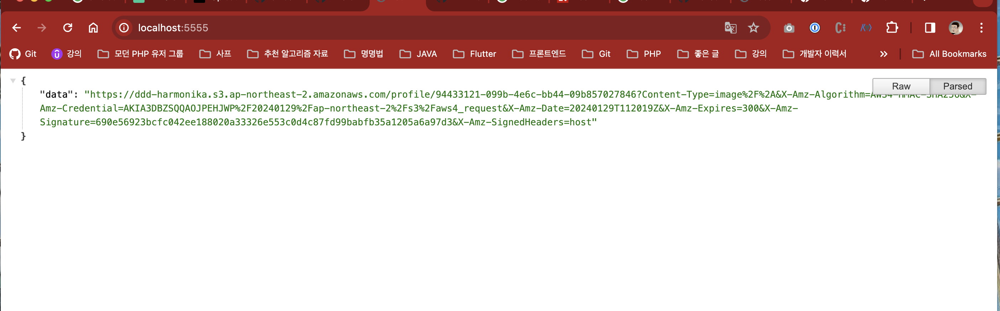
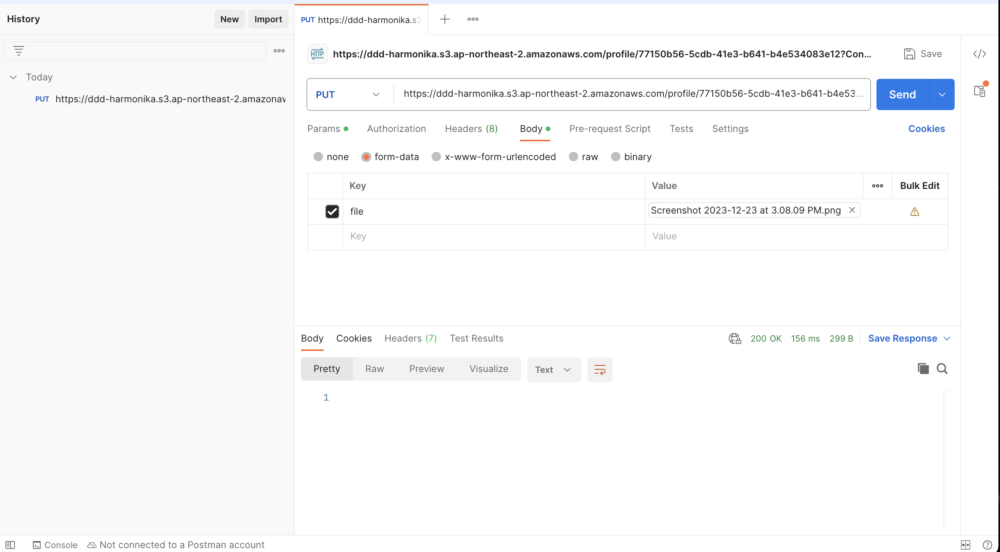
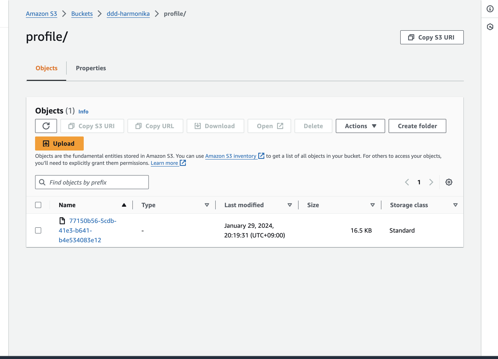
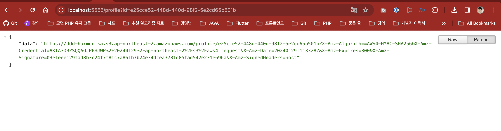

# node-presignedURL

```
GET http://locahost:5000

파일명은 서버에서 정함
```


```
클라이언트는 서명된 URL 으로 PUT 요청 때린다. 

단 Content-Type 을 잘 지정해야 한다. 안그러면 브라우저에서 도큐먼트로 떨어진다.

https://medium.com/developing-koan/uploading-images-to-s3-from-a-react-single-page-application-45a4d24af09f
```


```
S3 에 업로드 된 것을 확인할 수 있다.
```


```
S3 에 업로드된 URL 도 이런식으로 보여줄거다. 
그냥 URL 이미지 URL 이라 생각하고 src="으로 넣으면 된다"
```

